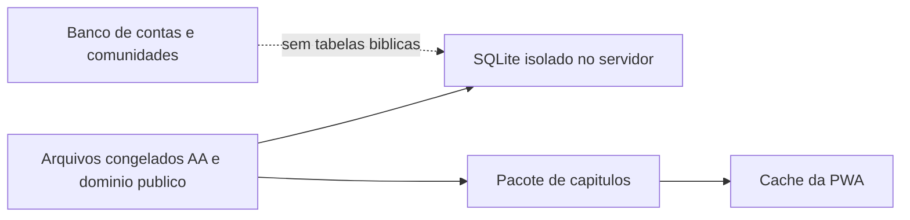

# Plano: corpus bíblico isolado

**Data:** 07/10/2026. **Estado:** proposta. Não está implementada. Não substitui a [spec 003](../../specs/003-conteudo-biblico/spec.md) até ela ser revisada. A leitura atual continua no SQLite único do desenvolvimento local.

Há duas entregas independentes: **migração do corpus** (§1–4, ainda proposta) e **configurações de leitura** (§5, [spec 009](../../specs/009-configuracoes-leitura/spec.md), aprovada e implementada na web local em 08/10/2026). Configurações usam AA existente, sem outras traduções nem download integral. Consulte [tasks e homologação pendente](../../specs/009-configuracoes-leitura/tasks.md). As diretrizes de §5 referentes ao pacote integral continuam futuras; modal, temas, escala, dois modos e janela de vizinhos já existem localmente.

## 1. O que muda

A Bíblia passa a morar fora do banco de usuários, sessões, devocionais e comunidades. Leitura e busca já não dependem da API da ABíbliaDigital; a migração também elimina o download externo na preparação e atualização, usando fontes congeladas.

Duas formas de armazenamento do corpus, além dos caches limitados de leitura:

| Cópia | Onde | Para quê |
|---|---|---|
| Segurança | Arquivo SQLite só da Bíblia, no servidor / máquina de desenvolvimento | Integridade, busca e recuperação. Não mistura com dados de conta |
| Aparelho | Pacote estático preparado em segundo plano ao abrir a Bíblia ou escolher uma edição validada | Leitura de capítulo sem rede e sem chamar API |

A API `https://abibliadigital.api.br` sai do caminho. O arquivo AA já importado (hash registrado em [bible-provider.md](bible-provider.md)) vira a fonte congelada. Se o provedor passar a exigir token, cota ou contrato, o produto não volta a consultá-lo: usa a cópia que já temos.

Usuários, devocionais, comunidades, mural e listas permanecem no banco da aplicação (hoje `devotio.sqlite`; no piloto, Convex). Nenhum deles referencia tabelas bíblicas. Uma citação no devocional ou no mural guarda o texto já escolhido, não uma chave viva para o corpus.

## 2. Formato

SQLite no celular exigiria um motor WASM só para abrir um capítulo. O caminho quente da Bíblia é “abrir este capítulo”, não varrer 31 mil versículos. Por isso o formato se divide:

- **Servidor:** um SQLite por edição (`bible-aa.sqlite`, `bible-alm1911.sqlite`, …). Tabelas mínimas: livros, versículos e índice FTS5. Sem usuários. É a cópia de segurança e o lugar da busca quando o aparelho ainda não baixou o índice.
- **PWA:** pacote estático da edição escolhida. Catálogo mais um JSON por capítulo. O tamanho bruto/comprimido, o índice de busca e o custo de transferência ainda precisam ser medidos; os 9 MB do SQLite não são uma estimativa do pacote. Um capítulo abre pelo cache, sem WASM e sem SQL no navegador. O service worker guarda o pacote da tradução selecionada. Não entra no precache do shell e não guarda sessão, devocional ou comunidade.

Medida de hoje, no banco misturado: cerca de 9 MB para a AA inteira com FTS ([bible-provider.md](bible-provider.md)). Separar e entregar capítulos em JSON reduz o que o celular precisa manter carregado: o arquivo da edição no disco e, na memória, o capítulo atual junto com o anterior e o próximo.

## 3. Edições

A escolha fica na configuração da conta (ou, no modo local, na preferência do perfil neste aparelho). A leitura, a busca e o pacote da PWA usam só a edição selecionada.

### AA — cópia local existente

Mantida como edição disponível, a partir do arquivo congelado:

- Fonte original: `pt_aa.json` do repositório ABíbliaDigital, commit `97f6803414d9aa0de570f11ffea9d46e7aff9df6`.
- SHA256 do JSON sem BOM: `7be3e6409ea1f042f9fc4b6a7c38b5e153e524a0794bd16bd99082d89b4fd496`.
- 66 livros, 1.189 capítulos, 31.104 versículos.

Não baixar de novo. Não chamar `books`, `verses` nem `search` da API. A licença de software daquele repositório não autoriza, por si, redistribuir o texto. Antes de publicar a PWA com AA para outras pessoas, a spec 003 §9.2 continua exigindo a condição de cópia. No desenvolvimento e na cópia de segurança, a AA permanece.

### Edições candidatas — [damarals/biblias](https://github.com/damarals/biblias)

O README desse repositório marca três edições com † e as apresenta como de domínio público, na consulta de 07/10/2026. Isso é uma declaração da fonte, não uma autorização conferida por este plano. A licença MIT do toolkit não deve ser aplicada automaticamente às traduções. Estas são as candidatas à migração, sujeitas ao registro das condições de uso e à aprovação da revisão da spec 003:

| Edição | Sigla no pacote | Ano | Classificação informada pela fonte |
|---|---|---|---|
| Almeida 1911 | ALM1911 | 1911 | Domínio público (†) |
| Tradução Brasileira | TB | 2010 | Domínio público (†) |
| Bíblia Livre | BLIVRE | 2018 | Domínio público (†) |

Fonte da tabela: [README de damarals/biblias](https://github.com/damarals/biblias). Arquivos: JSON da [última release](https://github.com/damarals/biblias/releases/latest). ACF, ARA, ARC, NVI, NVT e as demais sem † ficam de fora.

Cada pacote guarda sigla, nome, ano, URL do arquivo, commit ou tag da release e hash. Trocar a release exige novo hash. Não mapear AA para ALM1911 nem o contrário: são textos diferentes.

## 4. Fluxo

1. Os arquivos-fonte ficam versionados fora do banco da aplicação, com hash.
2. Um script gera o SQLite isolado e o pacote de capítulos. Falha no meio não apaga a cópia anterior.
3. O servidor de desenvolvimento e, depois, o de produção leem só esse SQLite para catálogo, capítulo e busca.
4. Ao abrir a Bíblia, o capítulo solicitado tem prioridade; a preparação offline pode baixar o pacote em segundo plano, com progresso e retomada. A instalação da PWA, sozinha, não garante execução de um download. Não bloquear a leitura pelo download integral nem baixá-lo na instalação do shell. Só mostrar “disponível offline” após verificar a integridade do pacote completo.
5. Trocar a edição na configuração baixa o outro pacote e passa a ler dele. A edição anterior pode ser apagada do aparelho.
6. Sem rede, reutilizar o capítulo disponível no cache mesmo que o pacote integral ainda não esteja pronto. Se o capítulo solicitado estiver ausente, explicar que ele ainda não está neste aparelho. Não chamar API externa.

## 5. Configurações de leitura

O menu do perfil ganha **Configurações**. A opção abre um modal. Fechar o modal volta para a página que já estava aberta, com o que foi escolhido. Não há botão de salvar: cada controle aplica na hora, inclusive dentro do próprio modal.

As preferências ficam no aparelho, ligadas ao perfil, fora do SQLite da Bíblia e fora do banco de comunidades. Persistem na recarga e não são confundidas com o cache descartável de capítulos. Ao sair/trocar de conta, a interface deixa de aplicar as escolhas daquela pessoa; ao reentrar no mesmo perfil/aparelho, restaura suas preferências. Sem sincronização entre aparelhos nesta entrega. Se o armazenamento falhar, a aplicação imediata em memória continua funcionando.

### Tema

Uma escolha só. As quatro primeiras são fixas. A quinta acompanha o relógio local do aparelho, sem pedir localização.

| Opção | O que a pessoa vê |
|---|---|
| Dia | Claro, para lugar muito iluminado |
| Noite | Fundo escuro, texto e superfícies claras em tons quentes/amarelados; sem branco intenso como padrão. Não promete efeitos sobre sono ou saúde |
| Papiro | Tons pastel, marrom e cinza puxados para o claro, com aspecto de papel velho |
| Contraste | Alto contraste entre claro e escuro, para quem precisa distinguir o texto com mais facilidade |
| Pelo horário | Das 6h às 18h no relógio local, usa Dia; das 18h às 6h, usa Noite. Reavalia ao abrir, ao voltar ao app e na virada desses horários |

Mudou o tema, as cores novas aparecem na mesma hora em toda a interface, inclusive no menu, no modal, nos campos, no menu lateral, na seleção de versos e nos estados de foco/erro. Não depender só de cor para indicar seleção. Dia é o padrão proposto. A faixa 6h–18h é uma decisão proposta para aprovação, sem localização, nascer do sol ou consulta de rede. Programar apenas a próxima transição e reavaliar ao voltar ao primeiro plano; não fazer polling de relógio/servidor.

Na tela editorial da spec 007, o fundo branco corresponde a Dia; os outros temas mudam as cores, mantendo tipografia uniforme e estrutura minimalista. Essa compatibilidade será formalizada na aprovação da spec 009.

### Tamanho da fonte

Proposta de escala graduada de oito tamanhos para o corpo de leitura, sem limitar a três presets. Os valores abaixo são escolhas do produto para validação visual, não um padrão universal de aplicativos. O CSS atual varia por viewport; 20 px passa a ser uma base proposta, não uma descrição do tamanho já implementado.

| Passo | Tamanho do corpo |
|---|---|
| 1 | 14 px |
| 2 | 16 px |
| 3 | 18 px |
| 4 | 20 px (padrão proposto) |
| 5 | 22 px |
| 6 | 24 px |
| 7 | 28 px |
| 8 | 32 px |

Controle deslizante com oito posições, tamanho atual informado e operação por teclado; os passos não são interpolados. Ao mover, o texto da página e do modal muda na hora. Títulos, rótulos, campos e interface acompanham a escala, com quebra de linha, altura flexível e rolagem quando necessário. Expressar tamanhos relativos à base e preservar zoom do navegador; não encolher a fonte para fazê-la caber. Usar o versículo visível como âncora após o ajuste, preservando seleção e formulários.

### Edição e modo de leitura

Na spec 009, o modal contém tema, fonte e modo de leitura. **AA permanece a única edição disponível.** O seletor de edição (AA, Almeida 1911, Tradução Brasileira ou Bíblia Livre) pertence à migração futura do corpus e só aparece após os pacotes serem validados e aprovados.

Os dois modos mantêm carregados o capítulo atual, o anterior e o próximo. No início de um livro não há anterior; no fim não há próximo.

| Modo | Leitura | Troca de capítulo |
|---|---|---|
| Contínuo | Capítulos empilhados, um abaixo do outro, como um texto corrido com a divisão de capítulo visível. Ao chegar no fim do capítulo atual, o seguinte já está na tela; a janela anda e o capítulo depois desse entra no lugar | Rolar a página. Sem gesto horizontal |
| Paginado | Um capítulo por vez | Arrastar o texto para a esquerda volta um capítulo; para a direita avança. Os botões no fim do capítulo fazem o mesmo. Só um arraste longo troca de capítulo; um movimento curto não troca. Arrastar para cima ou para baixo só move o texto dentro do capítulo |

“Contínuo” é o nome do modo que carrega o capítulo seguinte antes de a pessoa chegar nele. Ao trocar o modo, a Bíblia muda na hora: o contínuo mostra a sequência; o paginado mostra os botões no fim do capítulo e passa a responder ao arraste horizontal.

Paginado é o padrão proposto. As direções seguem o pedido: **esquerda = anterior; direita = próximo**, sem invertê-las por convenção de carrossel. Trocar o modo preserva o primeiro versículo visível, seleção, busca e contexto de retorno ao devocional/comunidade. Não exige recarga de página. Ao sair da Bíblia, não manter prefetch ativo.

### Gestos sem conflito

1. Campos, modal, controles e menu lateral têm prioridade sobre a navegação de capítulos. Arrastar o menu não seleciona versos nem troca capítulo; expandi-lo pela tela consome o gesto sem navegar.
2. Long-press seguido de arraste mantém a seleção contígua de versículos da spec 008. Seleção ativa suspende swipe de capítulo; a pessoa pode usar os botões de navegação, que limpam a seleção ao mudar capítulo.
3. Sem seleção nem menu capturando o gesto, um arraste horizontal grande no modo Paginado navega uma única vez. Proposta de limiar: pelo menos 80 px e 25% da largura útil, com deslocamento horizontal maior que duas vezes o vertical. Movimento curto, cancelado ou vertical não navega. Os valores precisam de verificação em aparelho físico.
4. No modo Contínuo, rolagem vertical não inicia seleção por si só. Long-press deliberado inicia seleção; um intervalo continua limitado a um capítulo, sem atravessar a divisão. Seleção contextual mantém apenas o botão flutuante já definido, sem abrir o menu normal.

### Janela, cache e orçamento de trabalho

| Camada | Limite / comportamento | Estado |
|---|---|---|
| Janela de leitura | Atual + anterior + próximo válidos no livro; nunca solicitar capítulo 0 ou além do último | Implementada localmente em 08/10/2026 |
| Cache recente no navegador | Até seis capítulos persistentes por perfil; AA é a única edição ativa, livro/capítulo identificam o item; reuso antes de rede | Integrado aos vizinhos em 08/10/2026; histórico de visitas separado das antecipações |
| Pacote offline no aparelho | Corpus da edição em disco, não inteiro em memória nem no DOM | Migração futura, não dependência da spec 009 |

Prefetch não deve expulsar o histórico útil antes da leitura: fixar a janela ativa e preencher as outras posições com os capítulos efetivamente acessados mais recentes. Um capítulo apenas antecipado não conta como visitado. Não aumentar o limite de seis por somar caches paralelos de cada modo.

O capítulo atual tem prioridade. Depois, preparar somente os vizinhos ausentes, com no máximo duas solicitações antecipadas simultâneas e deduplicação por edição/livro/capítulo. Exemplo: abrir João 3 a frio faz até três leituras locais (2, 3 e 4); avançar ao 4 reutiliza 3 e 4 e busca somente 5. Tema/fonte/mudança de modo sobre a mesma janela não fazem novas consultas. Capítulo inexistente não é repetido indefinidamente; falha do vizinho não esconde o atual e oferece tentativa explícita, sem loop de retry.

No modo Contínuo, renderizar uma janela limitada de capítulos, com compensação de espaço e âncora no versículo visível ao remover/inserir conteúdo. Não acumular o livro inteiro no DOM nem provocar saltos ao rolar para trás. A seleção ativa mantém seu capítulo na janela até limpar/mudar o destino, sem ampliar a janela indefinidamente. Ao avançar pela rolagem, adotar o novo capítulo atual apenas quando ele assumir a posição de leitura, não por pequenas oscilações na borda.

Carregamentos concluídos após troca de livro não alteram a tela atual. Persistência de preferências agrupa eventos rápidos do slider e grava o último valor ao concluir/fechar; atualização visual não espera disco ou servidor. O cache de conteúdo não é regravado por mudança de aparência. A persistência dos oito devocionais e os canais de notificações permanecem independentes.

### Evidências exigidas antes de marcar entregue

- Mudanças repetidas de tema/fonte geram zero chamadas de conteúdo e não recriam a sessão.
- Navegação sequencial carrega só o vizinho novo; revisita reutiliza cache; não há polling quando a pessoa fica parada.
- Leitura longa mantém até três capítulos completos na janela renderizada e até seis no cache, sem crescimento cumulativo.
- Troca de modo/fonte preserva âncora e seleção; ida/volta ao editor ou comunidade preserva os formulários.
- Verificação visual em tela pequena, fonte máxima e zoom; foco/seleção discerníveis em cada tema. Modal operável por teclado, com foco contido, Escape/fechar e retorno ao acionador.
- Gestos físicos de seleção, rolagem, menu e paginação verificados separadamente; simulação automatizada não comprova usabilidade por toque.

## 6. O que não muda de regra

- Texto bíblico é o mesmo para todo usuário autenticado. A configuração só escolhe a edição.
- Busca continua paginada. No aparelho, depois do download, a busca usa o índice incluído no pacote. Até lá, usa o SQLite do servidor.
- Devocional e mural não passam a “ler a Bíblia ao vivo”. Citação já gravada permanece como estava no momento da publicação.
- Anotações em versículos (`bibleMarkings`) continuam fora deste plano.

## 7. Mudanças na documentação

Documentar os requisitos e propostas antes do código. Atualizar descrições de implementação e evidências somente quando o comportamento existir. Este arquivo e a spec 009 descrevem o destino; o status continua descrevendo o estado real. Os ajustes da migração são:

| Documento | Ajuste |
|---|---|
| [spec 003](../../specs/003-conteudo-biblico/spec.md) | Revisar §8 e §9 antes da migração. Propor corpus fora do schema de contas e ALM1911, TB e BLIVRE após validação. API já está fora do runtime local. Manter o portão de licença da AA para publicação. |
| [spec 003 plan](../../specs/003-conteudo-biblico/plan.md) | Trocar Convex como único depósito do texto pelo par SQLite isolado + pacote PWA. |
| [bible-provider.md](bible-provider.md) | Preservar histórico da importação e fonte AA congelada. Registrar novos arquivos/hash e condições de uso quando verificados; distinguir runtime atual da preparação futura sem download externo. |
| [architecture.md](../architecture.md) | Tirar `bibleBooks` / `bibleVerses` / `bibleSearch` do banco da aplicação. Descrever o SQLite isolado e o cache da PWA. |
| [local-development.md](local-development.md) | `setup:local` deixa de baixar a API. Gera o corpus a partir dos arquivos já guardados. |
| [stack.md](stack.md) | Separar “banco da aplicação” e “corpus bíblico”. |
| [status.md](status.md) | Registrar a migração só quando o banco único não for mais a leitura bíblica. |
| [development-plan.md](../product/development-plan.md) | Atualizar D4/D5: AA congelada mais três edições de domínio público, escolha na configuração. |
| [ADR 003](../adr/003-local-sqlite-mock.md) | Nota de que o SQLite da aplicação não contém mais o corpus. |
| [free-launch.md](../operations/free-launch.md) | Medir armazenamento e tráfego de pacotes no hosting/CDN; sair do Convex não elimina cotas de transferência nem custos de distribuição. |
| [experience.md](../design/experience.md) | Menu do perfil com Configurações; modal de tema, fonte, edição e modo de leitura; aplicação imediata. |

Nenhuma dessas páginas deve ser reescrita como se a migração já tivesse ocorrido.

## 8. Ordem de execução

**Configurações:** revisar/aprovar spec 009 → plano/tasks → modal e preferências → dois modos com janela de três capítulos e cache existente → verificações de gestos, acessibilidade e rede. Esse trabalho não espera a migração abaixo.

**Migração do corpus, separadamente:**

1. Revisar a spec 003 com as edições e o isolamento acima.
2. Congelar os quatro arquivos (AA já hasheada; ALM1911, TB, BLIVRE da release) e recusar novo fetch da API.
3. Gerar SQLite isolado e pacote de capítulos. Testar contagem de versículos e as dez referências já usadas na AA.
4. Apontar a leitura e a busca da web para o corpus isolado.
5. Remover tabelas bíblicas do banco de usuários, devocionais e comunidades.
6. Preparar o pacote offline em segundo plano ao abrir a Bíblia e ao escolher uma edição validada, sem bloquear o capítulo solicitado.
7. Acrescentar o seletor de edição às Configurações após validar os pacotes; reutilizar a janela de três capítulos dos dois modos.
8. Atualizar os documentos da seção 7 com evidência, não só com a proposta.
