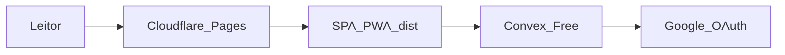

# Plano técnico: Publicação do piloto gratuito

**Spec relacionada:** [spec.md](./spec.md)  
**Status:** rascunho  
**Decisão de canal:** Cloudflare Pages Free + Convex Free + Google OAuth  
**Ambiente:** único (piloto = deployment Convex compartilhado)

## 1. Impacto no schema (`packages/backend/schema.ts`)

Nenhum. Reutiliza o schema da spec 004.

## 2. Funções Convex necessárias

Nenhuma função nova. Publicação usa o deployment real de `packages/backend` já implementado (auth Better Auth/Google, home, communities, editorial).

| Área existente | Papel no piloto |
|---|---|
| Auth HTTP / Better Auth | Login Google no URL Pages |
| Editorial interno | Conteúdo aprovado antes do convite |
| Queries/mutations de 001/002 | Uso pelos convidados |

## 3. Regras de negócio → `packages/domain`

Nenhuma regra nova de permissão. Em execução, apenas validar que configuração parcial/inválida continua bloqueando fixtures no build público (já coberto por testes da 004).

## 4. Impacto em `apps/web`

- Build estático Vite → `apps/web/dist`.
- Artefatos já preparados: [`public/_redirects`](../../apps/web/public/_redirects) (SPA fallback), [`public/_headers`](../../apps/web/public/_headers), PWA.
- Variáveis de build públicas: `VITE_CONVEX_URL`, `VITE_CONVEX_SITE_URL` (ver [`.env.example`](../../apps/web/.env.example)).
- Sem Pages Functions; sem mudança de rotas além do que a 004 já entrega.

### Configuração Cloudflare Pages (alvo)

| Campo | Valor |
|---|---|
| Repositório | GitHub `hilderney/devotio` (remote `origin`) |
| Root | `/` (monorepo) |
| Build | `npm ci && npm run build --workspace=web` |
| Output | `apps/web/dist` |
| Node | `24.19.0` ([`.node-version`](../../.node-version); env `NODE_VERSION`) |
| Env de build | `VITE_CONVEX_URL`, `VITE_CONVEX_SITE_URL` |

URL pública: subdomínio `*.pages.dev` gerado pelo Pages. Sem domínio customizado nesta fase.

## 5. Impacto em `apps/mobile`

Nenhum. Expo permanece adiado (task M1 da 004 aberta).

## 6. Riscos técnicos e decisões

| Risco | Mitigação |
|---|---|
| Plano Convex Starter com cobrança | Selecionar **Free** explicitamente; não habilitar faturamento automático |
| OAuth só validado em localhost | Smoke test obrigatório no `*.pages.dev` (Safari iOS + Chrome Android) |
| Consent Google em Testing | Cadastrar e-mails dos convidados; comunicar limite |
| Um ambiente mistura dados de teste e piloto | Não migrar fixtures; limpar/evitar dados demos; convite limitado |
| Áudio estoura egresso | Primeiro piloto sem áudio ou com poucas gravações; gatilhos em [free-launch](../../docs/operations/free-launch.md) |
| PWA cache desatualizada | Headers `no-cache` em `index.html`/`sw.js`; atualização opcional já na web |

### Por que esta escolha (e não alternativas)

| Opção | Veredito |
|---|---|
| **Cloudflare Pages + Convex** | Escolhida: ADR 001, ops docs, `_redirects`/`_headers`, cotas do piloto |
| Vercel / Netlify | Evitar agora: válidos para SPA, mas duplicam decisão e não usam artefatos Pages |
| Firebase Hosting | Evitar: outro ecossistema; backend já é Convex |
| Domínio / R2 / lojas | Fora desta fase |

## 7. Plano de testes

- Reexecutar lint, typecheck, testes e `npm run verify:web` antes do primeiro deploy.
- Manual no URL final: login, cancelamento OAuth, logout, refresh de rota SPA, criação/entrada em comunidade, tick pessoal, estado sem devocional do dia, offline honesto.
- Dispositivos: pelo menos Safari iOS e Chrome Android.
- Autorização: usuário de outro grupo sem acesso; membro sem escrita no mural — via funções reais, não só domain.
- Cotas: registrar plano Free e leitura inicial no painel após o primeiro dia de uso.

## 8. Operação e custo

### Sequência de execução guiada (contas do zero)

1. **Contas:** Cloudflare; Convex plano Free; Google Cloud OAuth (consent Testing).
2. **Convex:** `npx convex` com [`convex.json`](../../convex.json) → `packages/backend/`. Secrets: `BETTER_AUTH_SECRET`, `GOOGLE_CLIENT_ID`, `GOOGLE_CLIENT_SECRET`, `SITE_URL`. Anotar `.convex.cloud` e `.convex.site`.
3. **Local:** `.env.local` na web; validar login/logout antes do Pages.
4. **Google:** redirect `https://<DEPLOYMENT>.convex.site/api/auth/callback/google`; origins = URL Pages (+ localhost se ainda necessário).
5. **Pages:** conectar GitHub, build/output/Node/env conforme tabela acima; confirmar `_redirects` e `_headers` no artefato.
6. **Fechar circuito:** `SITE_URL` = origem Pages definitiva; redeploy se env mudar; smoke test mobile.
7. **Abertura:** conteúdo editorial aprovado; 20–50 convidados; monitoramento de cotas ([free-launch](../../docs/operations/free-launch.md), [release](../../docs/operations/release.md)).

### Segredos e ambientes

| Item | Onde | Público? |
|---|---|---|
| `VITE_CONVEX_URL` / `VITE_CONVEX_SITE_URL` | Build Pages | Sim |
| `BETTER_AUTH_SECRET`, OAuth client secret | Convex | Não |
| Token de deploy / CLI | Operador | Não |

Um só deployment Convex nesta fase. Detalhes de cotas e gatilhos: [docs/operations/free-launch.md](../../docs/operations/free-launch.md). Portões: [docs/operations/release.md](../../docs/operations/release.md). Guia local: [docs/engineering/development.md](../../docs/engineering/development.md).

### Relação com a 004

Esta spec **opera** R1 (credenciais/OAuth em dispositivos reais) e R2 (conteúdo e liberação do piloto) da 004; não as substitui. Evidências devem atualizar [tasks da 004](../004-fundacao-lancamento/tasks.md) e [status](../../docs/engineering/status.md) quando a execução ocorrer.
